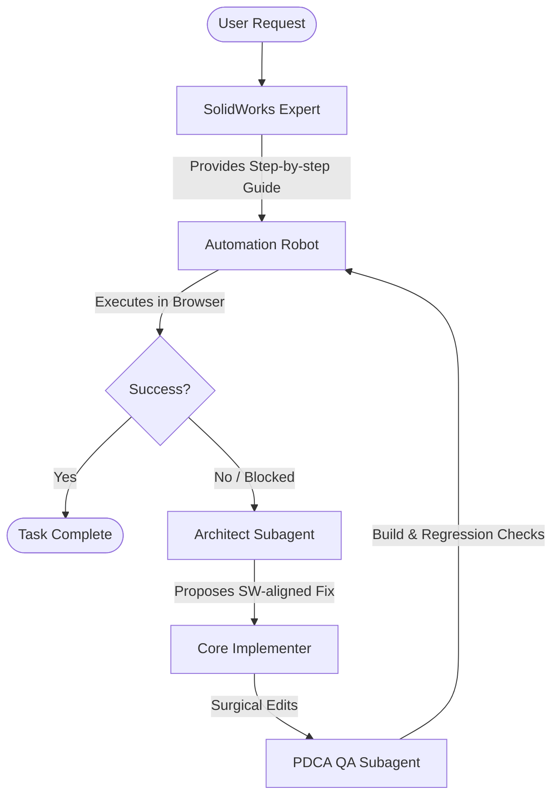

# SkillsBuilder Subagent Generation Plan (v2: Closed-Loop Automation)

## Goal Description
To introduce a **UI Automation Robot Subagent (實作機器人)** to the SkillsBuilder development mode. This subagent will complete the closed-loop PDCA cycle by physically simulating human interactions in the browser UI (via `browser_subagent`) to verify modeling tasks. It will follow instructions from the SolidWorks Expert, and feedback any roadblocks to the Architect, creating a self-healing development loop.

## The Closed-Loop Workflow (PDCA)

## Proposed Subagents

We will add one new subagent prompt file to `skills/dev/skills-builder-agents/` and update the `SKILL.md` orchestrator to enforce the closed-loop workflow.

### 1. `automation-robot-subagent-prompt.md`
**Role**: UI Automation Tester & Simulation Robot  
**Focus**: Executing step-by-step UI actions in the browser and validating geometric outcomes.  
**Responsibilities**:
- Translating the SolidWorks Expert's text guides into actual browser interactions (using the `browser_subagent` tool).
- Attempting complex modeling workflows (e.g., drawing hollow cylinders with draft angles and fillets).
- If the UI is missing a button, a tool doesn't snap, or an error occurs, it MUST stop and report exactly where the operational flow broke down to the **Architect**.

### 2. Update `SKILL.md`
**Changes**:
- Introduce the iterative loop protocol.
- Define the triggers for passing context from Robot -> Architect -> Implementer -> QA -> Robot.

## Open Questions
> [!IMPORTANT]
> - Since the Robot Subagent will need to actually interact with the UI, it will utilize the built-in `browser_subagent` capability to click buttons and verify the DOM. Is this align with your expectations for "simulating human operations"?
> - Do you want the Robot to capture screenshots/recordings (`RecordingName`) for you whenever it encounters a blocker?

## Proposed Changes

### Modified Files
#### [MODIFY] [SKILL.md](file:///c:/Users/USER/Downloads/3D-Builder/skills/dev/skills-builder-agents/SKILL.md)

### New Files
#### [NEW] [automation-robot-subagent-prompt.md](file:///c:/Users/USER/Downloads/3D-Builder/skills/dev/skills-builder-agents/automation-robot-subagent-prompt.md)

## Verification Plan
1. Generate the Robot Subagent prompt.
2. Update the `SKILL.md` to reflect the new loop.
3. Validate that the Robot Subagent understands how to consume SolidWorks tutorials and output actionable error reports for the Architect.
