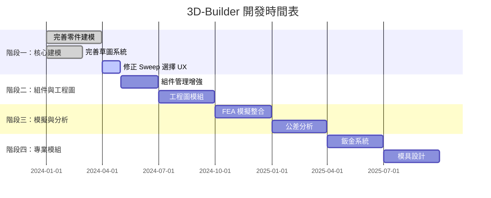

# 🚀 3D-Builder 開發路線圖 (基於 SOLIDWORKS 2025 專家知識標準)

## 路線圖總覽

## 階段一：核心建模 (已完成 80%)

### ✅ 已完成項目
- [x] 基本零件建模功能
- [x] 草圖繪製系統
- [x] Sweep 幾何引擎 (後端)
- [x] 基本特徵 (拉伸/旋轉/掃描)

### 🔧 進行中項目
- [ ] Sweep Profile/Path 選擇 UX 修正 (G1)
- [ ] 引導曲線 UI 實作 (G2)
- [ ] 掃出方向控制項 (G3)

### 📅 近期目標 (2024 Q2)
- 完成 G1-G3 所有缺口修正
- 建立 Configuration 管理系統
- 完善 2D/3D 轉換功能

## 階段二：組件與工程圖 (規劃中)

### 工程圖模組開發
- 工程圖基本要素
- 尺寸標準規範
- 標註系統
- BOM 表生成

### 組件管理增強
- 配合關係系統
- 大型組件處理
- 爆炸視圖功能

## 階段三：模擬與分析 (預備階段)

### FEA 模擬整合
- 結構分析求解器
- 熱分析模組
- 流體分析模組

### 公差分析
- TolAnalyst 整合
- 尺寸公差系統
- 幾何公差系統

## 階段四：專業模組 (長期規劃)

### 鈑金設計系統
- Sheet Metal 基本功能
- 展開與成形
- 標準件庫

### 模具設計
- 模具基本架構
- 流道設計
- 頂出系統

### 線路設計
- 線路佈線系統
- 電氣元件庫
- 線路分析

## 資源需求

### 人力配置
- 核心建模團隊: 3 人
- 工程圖團隊: 2 人
- 模擬分析團隊: 2 人
- 專業模組團隊: 3 人

### 技術架構
- 幾何引擎: OCCT (已整合)
- 前端框架: React + TypeScript
- 後端服務: Python + FastAPI
- 資料庫: SQLite/PostgreSQL

## 風險管理

### 技術風險
- OCCT 效能瓶頸
- 大型組件記憶體管理
- 多平台相容性

### 進度風險
- 工程圖模組複雜度
- 模擬求解器開發難度
- 專業模組領域知識

## 成功指標

### 技術指標
- SOLIDWORKS 功能對標度 > 80%
- 使用者操作效率提升 30%
- 系統穩定性 > 99.9%

### 業務指標
- 使用者滿意度 > 4.5/5
- 市場佔有率成長
- 專業認證通過率

## 持續改進

### 品質保證
- 每週功能測試
- 每月使用者回饋收集
- 每季 SOLIDWORKS 版本對標更新

### 知識管理
- 持續更新 SOLIDWORKS 參考標準
- 建立功能開發最佳實踐
- 維護 Gap Report 更新機制