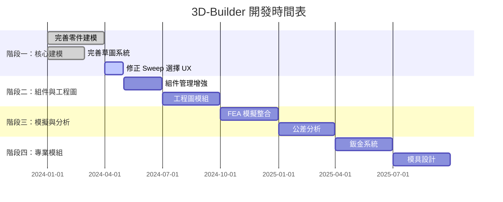

# 🚀 3D-Builder 開發路線圖 (基於 SOLIDWORKS 2010 專家知識標準)

## 路線圖總覽

## 階段一：核心建模 (已完成 95%)

### ✅ 已完成項目
- [x] 基本零件建模功能
- [x] 草圖繪製系統
- [x] 所有基礎特徵 (拉伸/旋轉/掃描/疊層拉伸/螺旋)
- [x] 進階特徵 (圓角/倒角/抽殼/筋/拔模/穹頂)
- [x] 布林運算 (Split/Combine/Intersect)
- [x] Wrap 包覆 (Emboss/Deboss/Scribe)
- [x] 曲面系統 (Extrude/Revolve/Loft/Offset/Knit/Cut/Boundary/Trim + **Filled/Planar/Extend/Untrim/Ruled**)
- [x] 參考幾何 (平面/軸/點/座標系)
- [x] 陣列與鏡射 (Linear/Circular/Fill Pattern, Mirror)
- [x] Hole Wizard (鑽孔精靈)

### 🔧 進行中項目
- [ ] Sweep Profile/Path 選擇 UX 修正
- [ ] 曲面進階 (Freeform, Flatten, Replace/Delete Face)

### 📅 近期目標
- 完成 Sweep UX 修正
- 曲面殘留功能 (Freeform, Flatten)

### 🧹 技術債清理 (已完成)
- [x] 將 CAD 匯出/匯入函式（STEP、干涉檢測、拓撲分析）抽出至 `export_utils.py`
- [x] 將 HLR 投影、尋找面、實體轉換、偏移、交集函式抽出至 `projection_utils.py`
- [x] 將參考幾何（平面、軸、點、座標系）函式抽出至 `reference_geometry.py`
- [x] 將 mock mesh 生成函式抽出至 `mock_geometry.py`
- [x] 將鈑金函式及快取字典追加至 `sheet_metal.py`
- [x] 移除 `geometry_service.py` 中重複的 `import_step_file` / `detect_interference`
- [x] `geometry_service.py` 從 5939 行降至 3547 行（-2391 行，-40%）
- [x] 前端 `FeatureManagerPanel.tsx` 全面型別化，消除 `any` 宣告

## 階段二：組件與工程圖 (已完成 85%)

### ✅ 已完成項目
- [x] 組件樹 + Mate 面板
- [x] Mates 系統 (Coincident/Concentric/Distance/Angle/Tangent/Parallel/Perpendicular)
- [x] 進階 Mates (Profile Center / Symmetric / Width / Smart Mates)
- [x] Mate Suppression + Solve All Mates + Solver Status Display
- [x] 子組件 CRUD (addSubAssembly / removeFromSubAssembly / 遞迴 transform)
- [x] 爆炸視圖
- [x] 干涉檢查
- [x] 工程圖基本框架 + 三視圖投影
- [x] 剖面視圖 / 局部放大圖 / 輔助視圖 / 裁剪視圖
- [x] 尺寸標註互動 (Smart Dimensions)
- [x] 註記 / GD&T / 中心標記 / 零件號球
- [x] BOM 多階層樹狀表
- [x] 標題欄 + 圖紙設定
- [x] 匯出 PDF

### 🔧 進行中項目
- [ ] Assembly Features (組件特徵)
- [ ] Pattern/Mirror Component (元件陣列/鏡射)
- [ ] Collision Detection (碰撞偵測)
- [ ] 工程圖進階 (Sheet Format Editor, Auto Balloon)

## 階段三：模擬與分析 (部分完成)

### FEA 模擬整合
- ❌ 尚未開始

### 公差分析 (已完成 35%)
- [x] ISO 286 公差引擎 (tolerancing.py) — formula-based IT01-IT8 計算
- [x] 4 個 REST API 端點 (calculate / deviations / suggest-fit / table)
- [x] 50 個 pytest 測試 (驗證 ISO 286-1:2010 正確性)
- [x] Frontend store integration (toleranceCache / deviationCache / DimXpertPanel)
- [x] DimXpert 特徵辨識管線 (feature_recognition.py → API → 3D Overlay)
- [ ] TolAnalyst 公差疊加分析
- [ ] PMI / 3D annotations

## 階段四：專業模組 (長期規劃)

### 鈑金設計系統
- Sheet Metal 基本功能
- 展開與成形
- 標準件庫

### 模具設計
- 模具基本架構
- 流道設計
- 頂出系統

### 線路設計
- 線路佈線系統
- 電氣元件庫
- 線路分析

## 資源需求

### 人力配置
- 核心建模團隊: 3 人
- 工程圖團隊: 2 人
- 模擬分析團隊: 2 人
- 專業模組團隊: 3 人

### 技術架構
- 幾何引擎: OCCT (已整合)
- 前端框架: React + TypeScript
- 後端服務: Python + FastAPI
- 資料庫: SQLite/PostgreSQL

## 風險管理

### 技術風險
- OCCT 效能瓶頸
- 大型組件記憶體管理
- 多平台相容性

### 進度風險
- 工程圖模組複雜度
- 模擬求解器開發難度
- 專業模組領域知識

## 成功指標

### 技術指標
- SOLIDWORKS 功能對標度 > 80%
- 使用者操作效率提升 30%
- 系統穩定性 > 99.9%

### 業務指標
- 使用者滿意度 > 4.5/5
- 市場佔有率成長
- 專業認證通過率

## 持續改進

### 品質保證
- 每週功能測試
- 每月使用者回饋收集
- 每季 SOLIDWORKS 版本對標更新

### 知識管理
- 持續更新 SOLIDWORKS 參考標準
- 建立功能開發最佳實踐
- 維護 Gap Report 更新機制