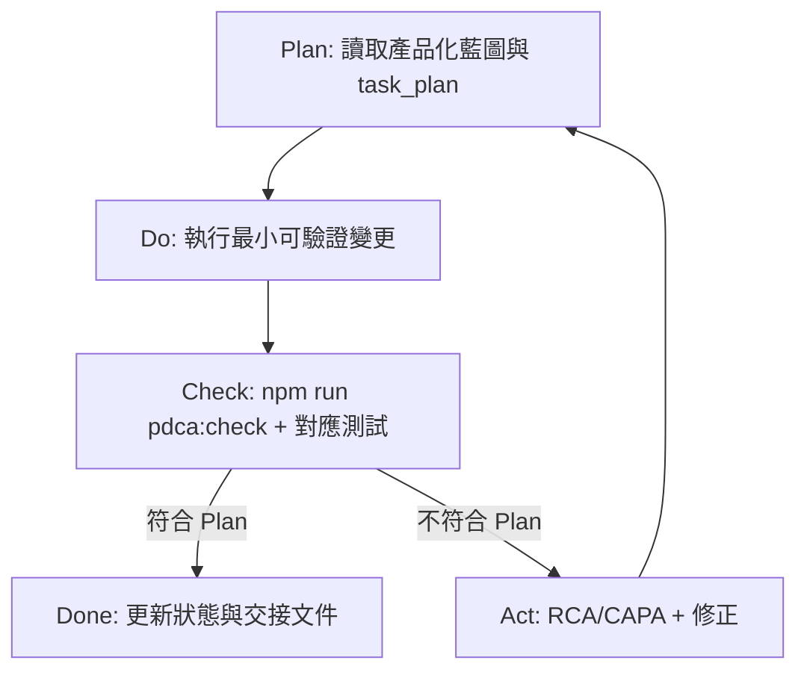

# PDCA Governance：Plan ⇄ Do ⇄ Check ⇄ Act 開發閉環

> 本文件定義 3D-Builder 產品化後所有開發與修訂必須遵守的閉環流程。其目標是讓每次輸出都能回頭對照 `docs/productization/PRODUCTIZATION_PLAN.md`，避免偏離產品化主線。

---

## 1. 核心原則

1. **Plan 是唯一產品化基準**  
   產品化方向、版本路線、優先級、風險與 release gate 以 `docs/productization/PRODUCTIZATION_PLAN.md` 為準。

2. **Do 必須最小可驗證**  
   每次開發應對應明確任務、Phase、Backlog 與驗收條件。避免無關重構、展示型代碼、猜測性修復。

3. **Check 必須自動化優先**  
   每次完成開發或修訂後，必須至少執行：

   ```bash
   npm run pdca:check
   ```

   若涉及 TypeScript / Next.js / Electron 代碼，也必須執行：

   ```bash
   npx tsc --noEmit
   ```

4. **Act 必須留下 RCA/CAPA**  
   若 Check 發現輸出與 Plan 不一致，必須在 `DEV_LOG.md` 依 `docs/governance/RCA_CAPA_TEMPLATE.md` 記錄 RCA/CAPA，並修正後重新 Check。

---

## 2. 標準循環



---

## 3. 開發前 Plan Checklist

開發者或 AI Agent 在開始前必須確認：

- [ ] 任務對應 `PRODUCTIZATION_PLAN.md` 的哪個 Phase？
- [ ] 任務對應哪條 Backlog 主線？
- [ ] 是否屬於 P0 / P1 / P2 / P3？
- [ ] 是否會影響 release gate？
- [ ] 是否需要新增/更新測試？
- [ ] 是否需要更新文件或 schema？
- [ ] 是否可能造成 `.sldprt` 原生相容性誤導？

---

## 4. 開發後 Check Checklist

完成開發或修訂後必須確認：

- [ ] `npm run pdca:check` 通過。
- [ ] TypeScript 相關變更已通過 `npx tsc --noEmit`。
- [ ] 變更未引入新的 `.sldprt` 偽相容宣稱或儲存流程。
- [ ] 若修改 Plan / governance / hooks，HTML 與 MD 文件仍存在且路徑正確。
- [ ] 若新增產品化功能，已對應 Plan 中的 Phase/Backlog。
- [ ] 若 Check 不通過，`DEV_LOG.md` 已補 RCA/CAPA。

---

## 5. RCA/CAPA 觸發條件

以下任一情況發生時，必須執行 RCA/CAPA：

1. `npm run pdca:check` 失敗。
2. TypeScript / build / test 失敗且非環境問題。
3. 開發輸出與 `PRODUCTIZATION_PLAN.md` 明確衝突。
4. 新增或保留 `.sldprt` 原生相容性誤導。
5. 引入 legacy `sketchPoints` 新依賴。
6. 幾何建模失敗沒有可理解錯誤訊息。
7. 新功能沒有對應測試、文件或 release gate 評估。

---

## 6. Hook 策略

本專案建立三層 hook：

### 6.1 SessionStart Hook

`hooks/session-start` 會在支援的 Agent/IDE 啟動時注入產品化 Plan 與 PDCA 提醒，確保開發開始前先讀 Plan。

### 6.2 NPM Check Hook

`npm run pdca:check` 執行 `tools/pdca-check.mjs`，檢查：

- Plan Markdown 是否存在。
- Plan HTML 是否存在。
- Governance 文件是否存在。
- RCA/CAPA 模板是否存在。
- `task_plan.md` 是否存在。
- `package.json` 是否註冊 PDCA scripts。
- 是否仍存在高風險 `.sldprt` 偽原生相容訊號。
- 若 git staged diff 命中高風險區域，是否同步 staged `DEV_LOG.md` 或 Plan 文件。

### 6.3 Git Pre-commit Hook

`INSTALL.ps1` 會安裝/更新 `.git/hooks/pre-commit`，讓提交前自動執行：

1. `npx tsc --noEmit`
2. `npm run pdca:check`

---

## 7. 允許的例外

若因環境未安裝依賴導致檢查不能執行，必須在最終回報中明確說明：

- 執行的命令。
- 失敗原因。
- 已完成的替代檢查。
- 下一步如何恢復完整 Check。

不得聲稱未執行的檢查已通過。
