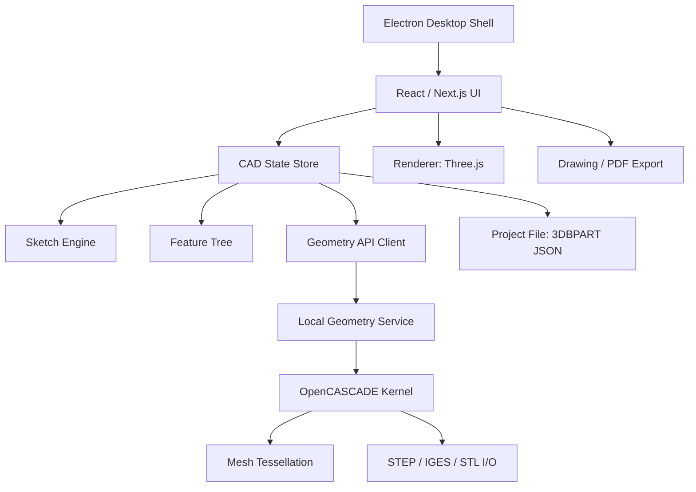
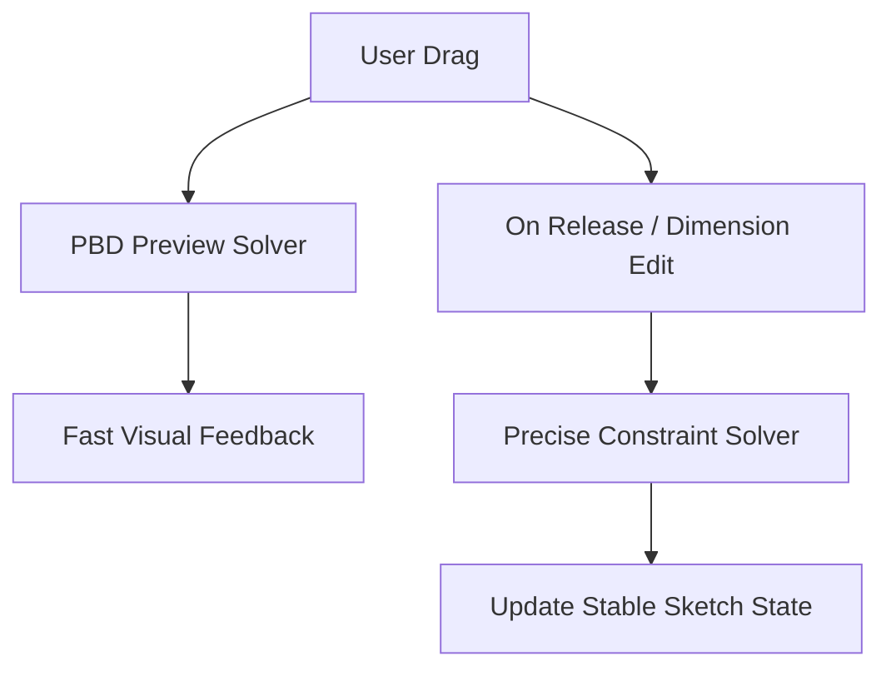
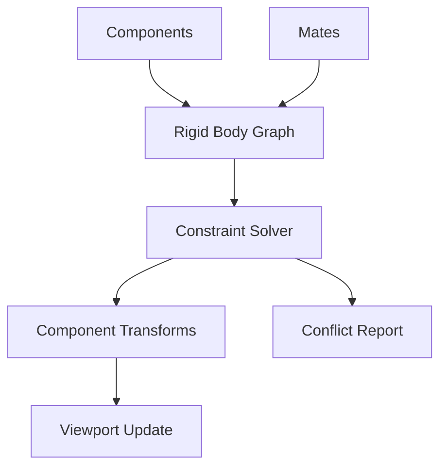

# 3D-Builder 產品化開發藍圖

> **文件角色**：本文件是 3D-Builder 後續產品化的 Plan of Record。所有開發或修訂（Do）完成後，必須回到本文件與 `docs/governance/PDCA_GOVERNANCE.md` 進行 Check；若發現輸出與計畫不一致，必須在 `DEV_LOG.md` 執行 RCA/CAPA 後再進入下一輪 Act。
>
> **版本**：1.0  
> **建立日期**：2026-05-24  
> **適用範圍**：3D-Builder 全專案（前端、Electron、PythonOCC 後端、文件、測試、發佈流程）

---

## 1. 產品定位

### 1.1 建議定位

3D-Builder 是一套以 OpenCASCADE 為幾何核心、受 SolidWorks 操作流程啟發的輕量化參數式 3D CAD 工具，聚焦於零件建模、基礎工程圖、標準格式交換與教育/中小型設計場景。

### 1.2 1.0 前禁止宣稱

- 完整取代 SolidWorks。
- 原生支援 `.sldprt` / `.sldasm`。
- 支援大型工業裝配。
- 支援完整鈑金、模具、Simulation、PDM。

### 1.3 初期主打價值

- 輕量、跨平台、開放格式。
- 現代 Web/Electron 桌面體驗。
- 基於 OpenCASCADE 的真 B-Rep 幾何核心。
- 參數化零件建模。
- STEP / STL / IGES 交換。
- 適合教學、Maker、原型、中小型設計與客製 CAD 場景。

---

## 2. 版本路線

| 階段 | 版本 | 目標 |
|---|---|---|
| Phase 0 | Internal Stabilization | 清理架構、建立產品化基礎 |
| Phase 1 | Alpha | 可穩定建立簡單零件 |
| Phase 2 | Private Beta | 可供小規模使用者測試 |
| Phase 3 | Public Beta | 對外釋出，支援基本工作流 |
| Phase 4 | 1.0 | 可正式交付的輕量 Part CAD |
| Phase 5 | 1.5 | 工程圖與匯入匯出強化 |
| Phase 6 | 2.0 | 裝配體與進階特徵 |

---

## 3. 產品化主線

1. 核心架構穩定化。
2. CAD 資料模型與檔案格式。
3. 草圖求解器。
4. 幾何核心與特徵建模。
5. 拓撲命名與引用穩定性。
6. UI / UX 工作流。
7. 匯入匯出與工程圖。
8. 測試、效能、可靠性。
9. 產品發佈、文件、授權、更新機制。

---

## 4. 目標架構



---

## 5. Phase 0：產品化基礎整理

**目標**：將專案從功能展示型原型整理成可長期維護的產品工程。  
**建議時程**：2 到 4 週。

### 5.1 正式定義產品檔案格式

目前專案不應把自家 JSON 存成 `.sldprt`。產品化應改為：

| 類型 | 副檔名 | 說明 |
|---|---|---|
| 3D-Builder Part | `.3dbpart` | 自家參數化零件格式 |
| 3D-Builder Assembly | `.3dbasm` | 未來裝配格式 |
| 3D-Builder Drawing | `.3dbdrw` | 未來工程圖格式 |
| STEP | `.step`, `.stp` | 通用交換 |
| STL | `.stl` | 3D 列印 / mesh |
| IGES | `.iges`, `.igs` | 曲面/舊 CAD 交換 |

`.sldprt` / `.sldasm` 初期只能提示：「SolidWorks 原生檔案目前不支援直接匯入，請從 SolidWorks 匯出 STEP 後再匯入。」

### 5.2 建立版本化 Schema

建議原生 Part 檔案格式：

```json
{
  "schema": "com.3dbuilder.part",
  "schemaVersion": "1.0.0",
  "appVersion": "0.4.0-alpha",
  "units": "mm",
  "features": [],
  "sketches": {},
  "materials": {},
  "metadata": {}
}
```

### 5.3 建立核心規格文件

必須建立或維護：

- `docs/spec/part-file-format.md`
- `docs/spec/feature-schema.md`
- `docs/spec/sketch-schema.md`
- `docs/spec/geometry-api.md`
- `docs/spec/release-gates.md`

### 5.4 移除 Legacy Flow

產品化前應逐步移除 legacy `sketchPoints` 流程，統一使用：

- `sketchNodes`
- `sketchEdges`
- `sketchConstraints`

### 5.5 建立測試基礎

最低測試門檻：

- TypeScript type check。
- ESLint。
- Frontend unit tests。
- Python backend tests。
- Geometry regression tests。
- Export roundtrip tests。

---

## 6. Phase 1：Alpha，穩定零件建模 MVP

**目標**：使用者可以穩定完成「建立草圖 → 加約束 → Extrude / Cut → Fillet / Chamfer → 匯出 STEP/STL」。  
**建議時程**：6 到 10 週。

### 6.1 MVP 功能範圍

#### 草圖

- Line、Rectangle、Circle、Arc、Centerline。
- Trim / Delete / Move / Select。
- Smart Dimension。
- Horizontal、Vertical、Coincident、Equal、Concentric、Tangent、Fixed。

#### 特徵

- Extrude Boss。
- Extrude Cut。
- Revolve Boss。
- Revolve Cut。
- Fillet。
- Chamfer。
- Linear Pattern。
- Circular Pattern。

#### 基準幾何

- Front / Top / Right Plane。
- Origin。
- Reference Plane。
- Reference Axis。

#### 檔案與交換

- Save `.3dbpart`。
- Open `.3dbpart`。
- Export STEP / STL / IGES。

#### 量測

- Distance。
- Angle。
- Area。
- Volume。
- Mass properties。

### 6.2 草圖求解器策略

保留 PBD 作為拖曳期間的 preview solver；在滑鼠釋放與尺寸編輯後，使用更精準的 constraint solver 執行穩定求解。



### 6.3 閉合輪廓演算法

必須支援：

- 多閉合輪廓。
- 內孔。
- 自交檢查。
- 重疊邊檢查。
- 開放輪廓提示。
- 外輪廓 / 內輪廓分類。
- Minimum Cycle Basis。
- CW / CCW 面積方向判斷。

### 6.4 特徵資料結構

建議統一格式：

```ts
interface Feature {
  id: string;
  type: FeatureType;
  name: string;
  suppressed: boolean;
  parentIds: string[];
  childIds: string[];
  parameters: Record<string, unknown>;
  createdAt: string;
  updatedAt: string;
  version: number;
}
```

### 6.5 幾何 API 合約

建議統一 API：

```txt
/api/v1/geometry/rebuild
/api/v1/geometry/preview
/api/v1/geometry/export
/api/v1/geometry/import
/api/v1/geometry/mass-properties
/api/v1/geometry/validate-sketch
/api/v1/geometry/project
```

### 6.6 錯誤回報

幾何失敗時必須回傳可理解訊息：

- 草圖未封閉。
- 草圖有自交。
- Fillet 半徑過大。
- Boolean cut 沒有與實體相交。
- Pattern 目標不存在。
- Face reference lost。

---

## 7. Phase 2：Private Beta

**目標**：5 到 20 位內部/種子使用者可完成真實小零件設計。  
**建議時程**：8 到 12 週。

### 7.1 標準測試模型

必須穩定完成：

1. L-Bracket。
2. Base plate with holes。
3. Shaft with revolve。
4. Flange。
5. Simple enclosure。
6. Mounting plate。
7. Pulley。
8. Simple 3D printed bracket。

### 7.2 Topological Naming 初版

建議引用 schema：

```ts
interface TopologyReference {
  featureId: string;
  topologyType: 'FACE' | 'EDGE' | 'VERTEX';
  localIndex?: number;
  geometricSignature: {
    center?: [number, number, number];
    normal?: [number, number, number];
    area?: number;
    length?: number;
    curvatureType?: 'PLANE' | 'CYLINDER' | 'SPHERE' | 'CONE' | 'UNKNOWN';
  };
}
```

### 7.3 Feature rollback 完整化

- Rollback bar UI。
- Suppress / Unsuppress feature。
- Reorder feature。
- Edit sketch。
- Edit feature。
- Parent/child dependency warning。
- Broken reference warning。

### 7.4 STEP / STL Import

| 格式 | 匯入方式 |
|---|---|
| STEP | 匯入為 dumb solid |
| IGES | 匯入為 surfaces/shape |
| STL | 匯入為 mesh reference |

### 7.5 UX 打磨

- Undo / Redo。
- Autosave。
- Recent files。
- File dirty state。
- Command search。
- Context menu。
- Selection filter。
- Keyboard shortcuts。
- Error toast。
- Progress indicator。
- Rebuild status。

---

## 8. Phase 3：Public Beta

**目標**：可公開釋出並收集外部回饋。  
**建議時程**：8 到 12 週。

### 8.1 安裝包

- Windows installer。
- macOS dmg。
- Linux AppImage。
- Code signing。
- Auto update。
- Crash reporting。
- Version channel。

### 8.2 本機幾何服務管理

Electron 必須負責：

- 啟動 Python backend。
- 偵測 backend health。
- Port collision handling。
- Backend crash restart。
- Backend log collection。
- Graceful shutdown。
- Bundled Python/OCC runtime。

### 8.3 遙測與錯誤收集

需尊重隱私並採 opt-in，但產品化至少需要：

- Crash logs。
- Failed rebuild logs。
- Feature type error。
- OS / version。
- Anonymous usage metrics。

### 8.4 文件與教學

- Quick Start。
- First Part Tutorial。
- Sketch Tutorial。
- Export Tutorial。
- Known Limitations。
- FAQ。
- Keyboard Shortcuts。
- Release Notes。

---

## 9. Phase 4：1.0 正式版

**1.0 目標**：3D-Builder 1.0 是可正式交付的輕量參數化零件 CAD，可完成基礎機械零件建模、量測、工程圖 PDF 與 STEP/STL/IGES 匯出。

### 9.1 1.0 必備功能

#### Part Modeling

- Sketch on standard planes。
- Sketch on planar faces。
- Extrude Boss / Cut。
- Revolve Boss / Cut。
- Fillet / Chamfer。
- Linear / Circular Pattern。
- Reference Plane / Axis。

#### Sketch

- Robust closed profile detection。
- Dimension-driven sketch。
- Common constraints。
- Over-defined warning。
- Under-defined indication。
- Sketch color states。

#### File

- `.3dbpart` native save/load。
- STEP / STL / IGES export。
- STEP import as dumb solid。

#### Drawing

- Basic 3-view drawing。
- Isometric view。
- A4 PDF export。
- Basic dimensions。
- Title block metadata。

#### Evaluate

- Distance、Angle、Surface area、Volume、Center of mass、Inertia matrix。

#### Product

- Installer。
- Auto update。
- Crash logs。
- User docs。
- Example models。
- License/about screen。

---

## 10. Phase 5：1.5，工程圖與互通性強化

### 10.1 工程圖

- Section View。
- Detail View。
- Hidden line。
- Center mark / Centerline。
- Hole callout。
- Linear / Diameter / Radius / Angular dimensions。
- Title block templates。
- Multi-sheet drawing。

### 10.2 匯入匯出

- STEP AP203 / AP214 / AP242 選項。
- STL binary/ascii。
- Export units。
- Import healing。
- Import scale detection。
- Export validation。

### 10.3 材料與屬性

- Material library。
- Density。
- Appearance。
- Mass calculation using material density。
- Part number、Description、Author、Revision、Custom properties。

---

## 11. Phase 6：2.0，裝配體與進階 CAD

### 11.1 Assembly MVP

- Insert component。
- Move / Rotate component。
- Fixed / floating component。
- Coincident / Concentric / Parallel / Distance / Angle mate。
- Interference detection。
- Simple BOM。

### 11.2 Assembly Solver



### 11.3 進階特徵

- Shell。
- Draft。
- Sweep。
- Loft。
- Mirror。
- Hole Wizard 初版。
- Thread representation。
- Rib。
- Split body。
- Combine bodies。

### 11.4 多實體零件

- Multiple bodies。
- Body folder。
- Hide/show body。
- Boolean combine。
- Export selected body。

---

## 12. 分線 Backlog

### 12.1 核心架構

| 優先級 | 任務 |
|---|---|
| P0 | 統一 native file extension 為 `.3dbpart` |
| P0 | 定義 feature schema |
| P0 | 定義 sketch schema |
| P0 | 重構 `src/app/page.tsx`，拆分大型元件 |
| P0 | 建立 geometry API contract |
| P1 | 建立 command system |
| P1 | 建立 undo/redo command stack |
| P1 | 建立 app-level error boundary |
| P2 | 支援多文件視窗 |

### 12.2 Sketch Engine

| 優先級 | 任務 |
|---|---|
| P0 | 移除 legacy `sketchPoints` 流程 |
| P0 | 統一使用 graph sketch model |
| P0 | 完整 closed profile detection |
| P0 | Smart Dimension 可驅動 geometry |
| P0 | 顯示 fully-defined / under-defined / over-defined |
| P1 | Constraint residual report |
| P1 | Trim / Extend |
| P1 | Offset sketch |
| P1 | Mirror sketch |
| P2 | 3D sketch |

### 12.3 Geometry Kernel

| 優先級 | 任務 |
|---|---|
| P0 | Rebuild API 穩定化 |
| P0 | Extrude / Cut 錯誤診斷 |
| P0 | Revolve / Cut 錯誤診斷 |
| P0 | Fillet / Chamfer 失敗原因回傳 |
| P0 | STEP/STL/IGES export validation |
| P1 | STEP import |
| P1 | Shape healing |
| P1 | Shell |
| P1 | Draft |
| P2 | Sweep / Loft |
| P2 | Multi-body |

### 12.4 Topology / Reference

| 優先級 | 任務 |
|---|---|
| P0 | Face / Edge reference schema |
| P0 | Geometric signature matching |
| P0 | Broken reference detection |
| P1 | Topological naming service |
| P1 | Parent/child relation graph |
| P1 | Reference repair UI |
| P2 | Persistent topology IDs |

### 12.5 Feature Tree

| 優先級 | 任務 |
|---|---|
| P0 | Edit Feature |
| P0 | Edit Sketch |
| P0 | Rollback bar |
| P0 | Suppress / Unsuppress |
| P1 | Reorder feature |
| P1 | Feature error state |
| P1 | Parent/child highlight |
| P2 | Configurations |

### 12.6 UI / UX

| 優先級 | 任務 |
|---|---|
| P0 | CommandManager 整理 |
| P0 | PropertyManager 統一 |
| P0 | Context menu |
| P0 | Selection filter |
| P0 | Undo / Redo |
| P1 | Command search |
| P1 | Shortcut customization |
| P1 | Theme support |
| P2 | Touch / pen support |

### 12.7 Drawing

| 優先級 | 任務 |
|---|---|
| P0 | 三視圖投影穩定 |
| P0 | PDF export |
| P0 | Basic dimensions |
| P1 | Section view |
| P1 | Detail view |
| P1 | Center marks |
| P1 | Title block templates |
| P2 | GD&T |

### 12.8 Assembly

| 優先級 | 任務 |
|---|---|
| P1 | Assembly file schema |
| P1 | Insert component |
| P1 | Component transform |
| P1 | Fixed / floating |
| P2 | Mate solver |
| P2 | Interference detection |
| P2 | BOM |
| P3 | Exploded view |

### 12.9 Productization

| 優先級 | 任務 |
|---|---|
| P0 | Windows installer |
| P0 | Backend bundling |
| P0 | Crash log |
| P0 | Auto update |
| P0 | License/about |
| P1 | Code signing |
| P1 | macOS package |
| P1 | Linux AppImage |
| P1 | Telemetry opt-in |
| P2 | In-app marketplace/plugin |

---

## 13. 測試與驗收標準

### 13.1 幾何 Golden Tests

每個標準模型應保存：

- `.3dbpart`。
- Expected volume。
- Expected surface area。
- Expected bounding box。
- Expected exported STEP。
- Screenshot baseline。

| 模型 | 驗收 |
|---|---|
| Box | 體積正確，STEP 可開啟 |
| L-Bracket | cut / fillet 正確 |
| Flange | circular pattern 正確 |
| Shaft | revolve 正確 |
| Enclosure | shell / holes 正確 |
| Plate with holes | sketch loops / inner holes 正確 |

### 13.2 草圖測試

| 測試 | 驗收 |
|---|---|
| 矩形四邊水平垂直 | fully defined |
| 圓與線相切 | residual 低於 tolerance |
| 雙圓同心 | center distance 近 0 |
| 過定義尺寸 | 顯示 conflict |
| 未封閉輪廓 extrude | 顯示錯誤 |

### 13.3 匯出測試

| 格式 | 驗收 |
|---|---|
| STEP | FreeCAD / OpenCASCADE 可重新開啟 |
| STL | slicer 可讀取 |
| IGES | OCCT 可重新讀入 |
| PDF | A4 尺寸正確 |

---

## 14. 效能目標

| 項目 | 1.0 目標 |
|---|---|
| 啟動時間 | 小於 5 秒 |
| 開啟簡單零件 | 小於 2 秒 |
| Rebuild 20 features | 小於 1 秒 |
| 草圖拖曳回饋 | 60 FPS 目標 |
| STEP export 小零件 | 小於 3 秒 |
| PDF drawing export | 小於 3 秒 |

中期優化：Geometry service job queue、Incremental rebuild、Mesh cache、Feature dependency rebuild、Worker thread、WebGL draw call optimization、Large mesh LOD。

---

## 15. 風險與對策

| 風險 | 對策 |
|---|---|
| 草圖約束求解不穩 | PBD 只做 preview；最終尺寸用精準 solver；建立 residual report 與 regression tests |
| 拓撲命名失效 | 建立 topology reference schema；使用 geometric signature fallback；Broken reference UI |
| `.sldprt` 誤導使用者 | 改用 `.3dbpart`；`.sldprt` 僅提示不支援原生匯入 |
| PythonOCC 打包困難 | 優先鎖定 Windows；使用 bundled Python runtime；建立 backend health/restart manager |
| 單檔過大難維護 | 拆分 `src/app/page.tsx` 到 features/services/components 分層 |

---

## 16. 建議團隊配置

| 角色 | 人數 | 職責 |
|---|---:|---|
| CAD Kernel Engineer | 1-2 | OpenCASCADE、幾何、拓撲 |
| Frontend CAD UI Engineer | 1-2 | React、Three.js、UX |
| Desktop/Electron Engineer | 1 | 打包、IPC、更新、檔案 |
| QA / Automation Engineer | 1 | 測試、自動化、回歸 |
| Product Designer | 0.5-1 | CAD UX、視覺、工作流 |
| Technical Writer | 0.5 | 文件、教學、release notes |

---

## 17. 12 個月建議時程

| 月份 | 目標 |
|---|---|
| Month 1 | 清理 `.sldprt` 偽相容；建立 `.3dbpart`；拆分大型 page；建立測試框架；定義 schema |
| Month 2 | 草圖 graph model 統一；移除 legacy sketchPoints；closed profile detection 強化；Extrude/Cut 穩定 |
| Month 3 | Smart Dimension 強化；約束狀態分析；Feature edit / Sketch edit 穩定；Rollback bar 完整化 |
| Month 4 | Fillet / Chamfer 錯誤處理；Pattern 穩定；Export validation；Golden geometry tests |
| Month 5 | STEP import as dumb solid；Topology reference 初版；Face sketch 穩定；Broken reference warning |
| Month 6 | Alpha release；內部測試模型集；Installer 初版；Backend bundling 初版 |
| Month 7 | Undo / Redo；Autosave；Recent files；Context menu；Selection filter |
| Month 8 | Drawing 三視圖穩定；Basic dimension；PDF export；Title block |
| Month 9 | Private Beta；使用者回饋；Crash reporting；性能優化 |
| Month 10 | 文件與教學；Public Beta；Auto update；Code signing |
| Month 11 | Bug bash；Export/import 修復；UI polish；Release candidate |
| Month 12 | 1.0 release；官網/文件/範例模型；支援流程建立 |

---

## 18. 1.0 Release Gate

### 18.1 功能門檻

- [ ] 可建立至少 10 個標準測試零件。
- [ ] 可儲存/開啟 `.3dbpart`。
- [ ] 可匯出 STEP/STL/IGES。
- [ ] 可完成基本三視圖 PDF。
- [ ] 可量測距離、角度、面積、體積。
- [ ] 可編輯既有 sketch 和 feature。
- [ ] 可 rollback。

### 18.2 品質門檻

- [ ] TypeScript 無 error。
- [ ] Backend pytest 通過。
- [ ] E2E 建模流程通過。
- [ ] 20 次連續 rebuild 無 crash。
- [ ] 匯出的 STEP 可由 FreeCAD 或 OCCT 重新開啟。
- [ ] Windows installer 可安裝/解除安裝。

### 18.3 文件門檻

- [ ] Quick Start。
- [ ] First Part Tutorial。
- [ ] Export Tutorial。
- [ ] Keyboard Shortcuts。
- [ ] Known Limitations。
- [ ] Release Notes。

---

## 19. 最優先的前 10 件事

1. 停止把 JSON 存成 `.sldprt`，改成 `.3dbpart`。
2. 定義正式 Part file schema。
3. 拆分 `src/app/page.tsx`。
4. 移除 legacy `sketchPoints`，統一 graph sketch。
5. 重寫 closed profile detection。
6. 建立 geometry regression tests。
7. 補 STEP import as dumb solid。
8. 建立 topology reference schema。
9. 完善 backend process management。
10. 建立 Alpha 測試模型集。

---

## 20. 對外訊息建議

避免在產品名稱或文案中過度使用 SolidWorks 關聯字眼，降低商標與期待落差風險。

建議中文描述：

> 一套基於 OpenCASCADE 的輕量參數化 CAD 工具，提供現代化桌面建模流程。

建議英文描述：

> A lightweight parametric CAD tool powered by OpenCASCADE, designed for modern desktop workflows.

---

## 21. PDCA 執行要求

任何開發或修訂完成後，必須執行：

```bash
npm run pdca:check
```

若檢查不通過：

1. 回到本 Plan 找出不一致項。
2. 在 `DEV_LOG.md` 使用 RCA/CAPA 模板記錄根因與矯正預防措施。
3. 修正 Do 的輸出。
4. 重跑 `npm run pdca:check`。
5. 持續循環直到 Check 通過。

相關文件：

- `docs/governance/PDCA_GOVERNANCE.md`
- `docs/governance/RCA_CAPA_TEMPLATE.md`
- `tools/pdca-check.mjs`
