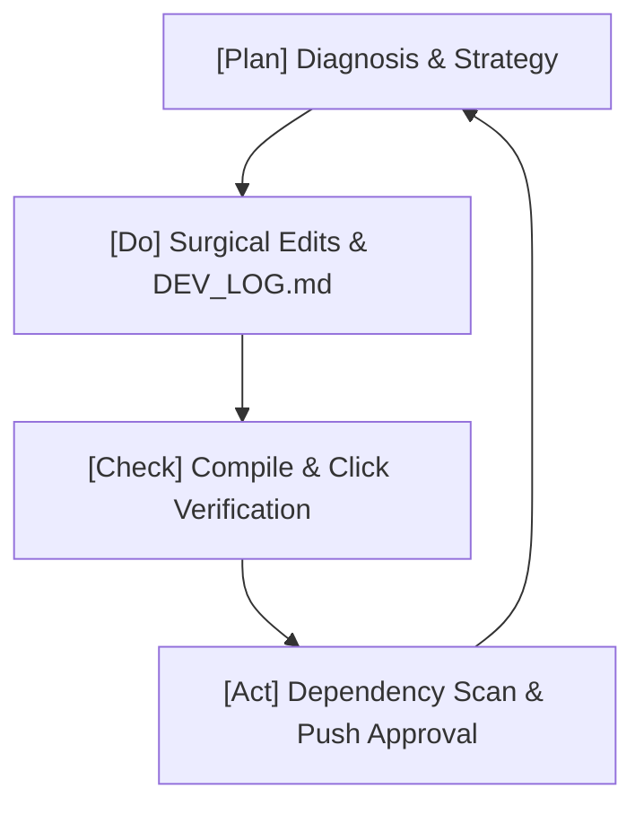

# PDCA Development SOP & Quality Guardrails

At **3D-Builder**, software reliability is guaranteed using a rigorous, closed-loop **Plan-Do-Check-Act (PDCA)** engineering framework. We reject "guess-and-check" hacking in favor of precise, surgical modifications.

---

## 1. The Closed-Loop PDCA Cycle

### A. Phase [Plan]: Diagnosis & Strategy
1.  **Deep Scan**: Evaluate the codebase and identify "fragility hot spots" (Zustand state model, async calculations, or React Three Fiber re-rendering loops).
2.  **Surgical Strategy**: Draft precise modification plans using the MECE principle. Avoid broad, destructive rewrites.
3.  **User Review**: Present the plan and obtain explicit user permission before touching functional source files.

### B. Phase [Do]: Precision Execution
1.  **Surgical Modifications**: Edit files targeted in the approved plan. Preserve all unrelated comments and docstrings.
2.  **Development Logging**: Record every step inside `DEV_LOG.md` using the standard RCA (Root Cause) & CAPA (Corrective and Preventive Actions) format.

### C. Phase [Check]: Mandatory Verification
1.  **Zero-Error Compilation**: Run `npx tsc --noEmit` globally. The exit code must be `0` (zero type errors or warnings).
2.  **Zero-Console Errors**: Load/simulate the Electron/Next.js client and verify the browser console has zero red errors.
3.  **Horizontal Expansion Check**: If a UI layout or constraint calculation bug is fixed, search the entire project to ensure identical code patterns are updated together.
4.  **Critical Path Click Test**: Manually or programmatically click all affected elements (e.g. ribbon buttons, Sidebar Feature nodes, properties manager checkboxes) to confirm handlers remain bound.

### D. Phase [Act]: Review & Branch Management
1.  **Blast Radius Scan**: Verify that API or store updates do not break other pages or sub-components.
2.  **Git Syncing**: Execute `graphify . --update` to synchronize the local semantic code graph, and report outcomes to the user before push.

---

## 2. Anti-Regression Safeguards
- **Imports Audit**: Never introduce a model or hook without explicitly adding its import statement at the top of the file.
- **Strict Typing**: Refuse the `any` fallback typing for active CAD features or sketch nodes. Always declare explicit TypeScript interfaces.
